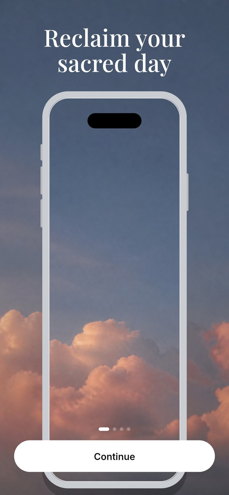
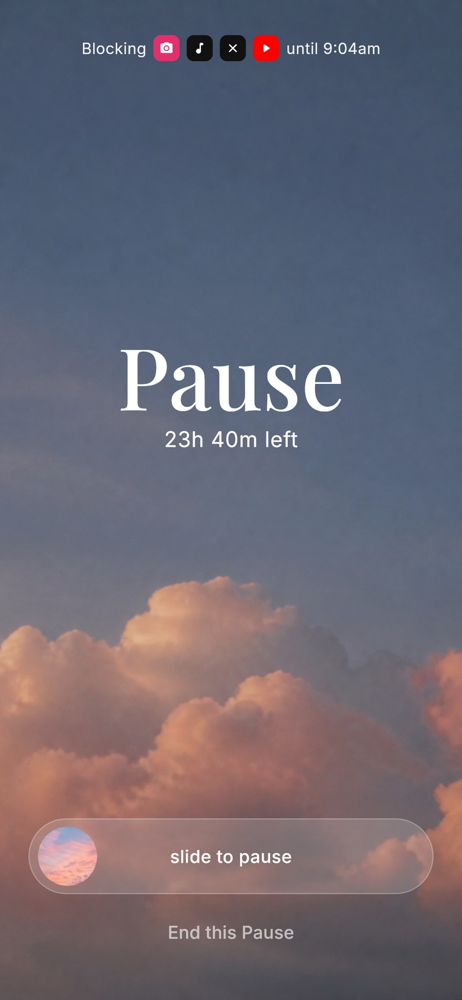
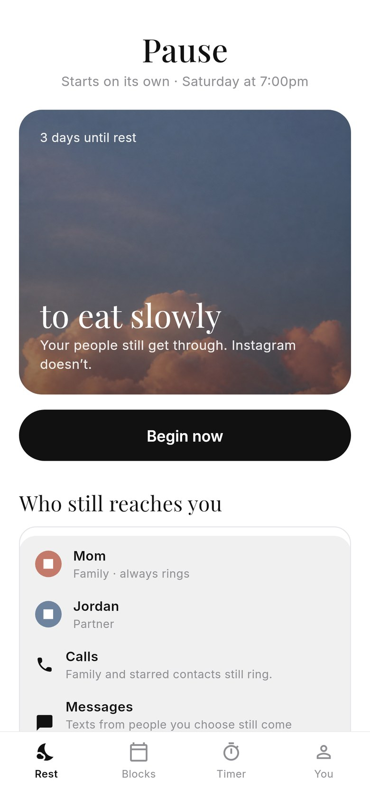
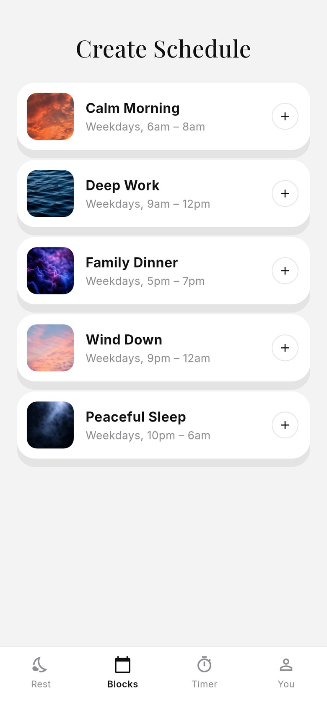
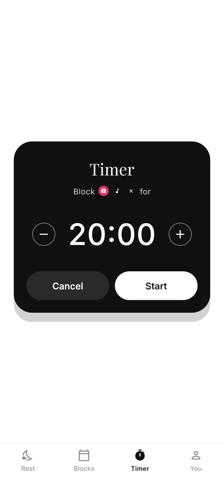
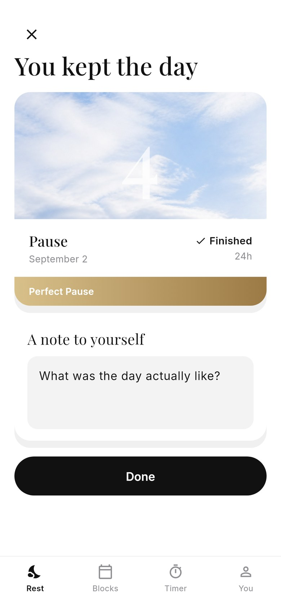

<p align="center">
  
</p>

<h1 align="center">Pause</h1>

<p align="center">
  A modern app for an ancient practice.<br />
  Put your phone down one day a week.
</p>

<p align="center"><strong>Your people still get through. Instagram doesn’t.</strong></p>

<p align="center">
  Offline first. No account. No circle. No feed. Nothing leaves this phone.
</p>

<p align="center">
  
  
  
  
  
  
</p>

## What’s on the device

- Sacred day: Saturday or Sunday, sundown to sundown, starts on its own
- Lifelines stored locally: calls, messages, Slack DMs, Maps
- VIP names on this phone who still ring
- Quiet apps
- An intention for the day
- Slide to pause, with a private reason
- Postcard recap and a note to yourself
- Weekday blocks and a deep-rest timer
- Candle icon, dusk skies, dinner-table stills

All of it lives in local storage. There is no server and no paywall.

## Run

```bash
flutter pub get
flutter test
flutter run -d chrome
```
